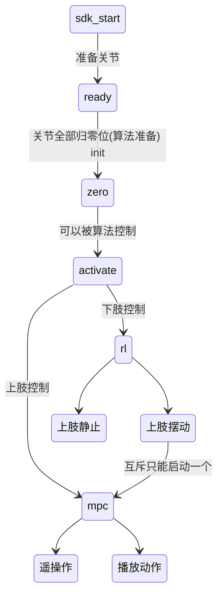
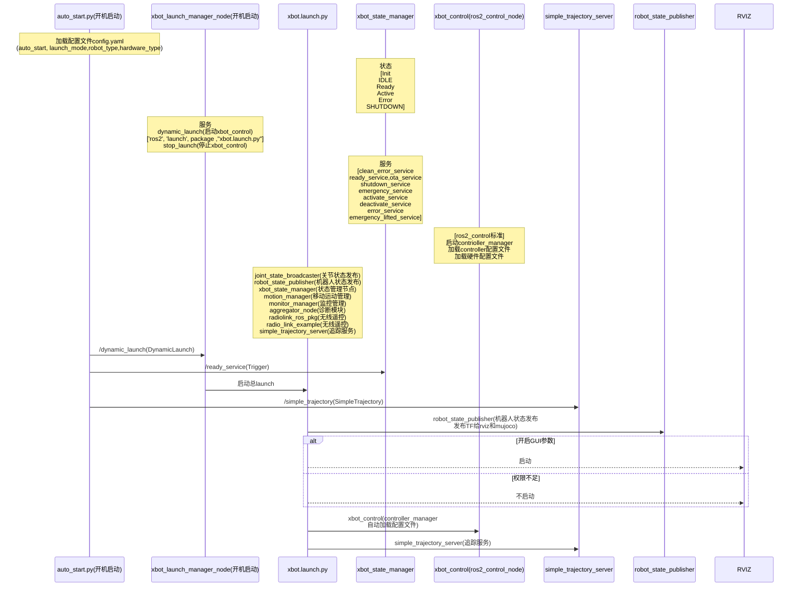
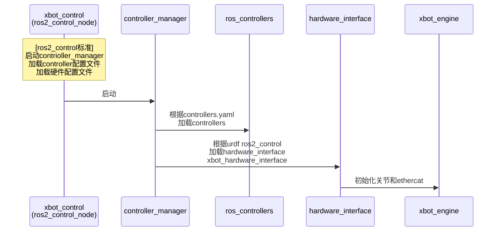
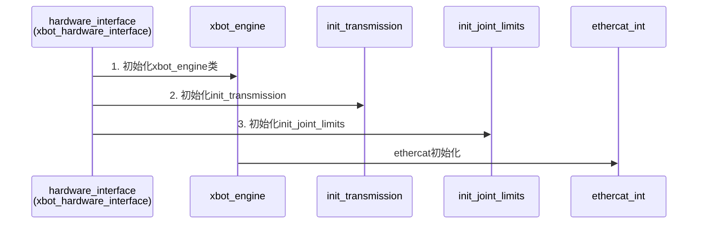
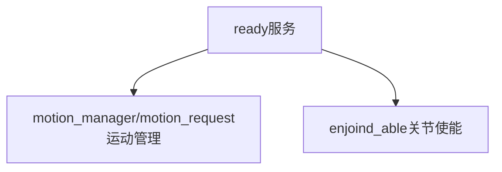
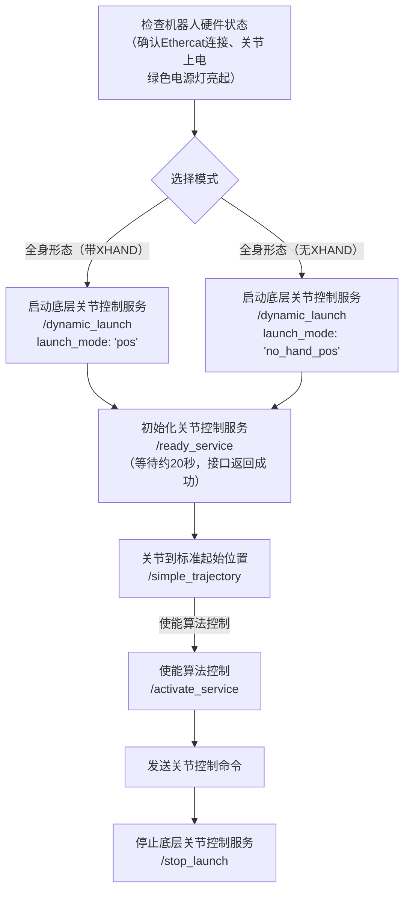
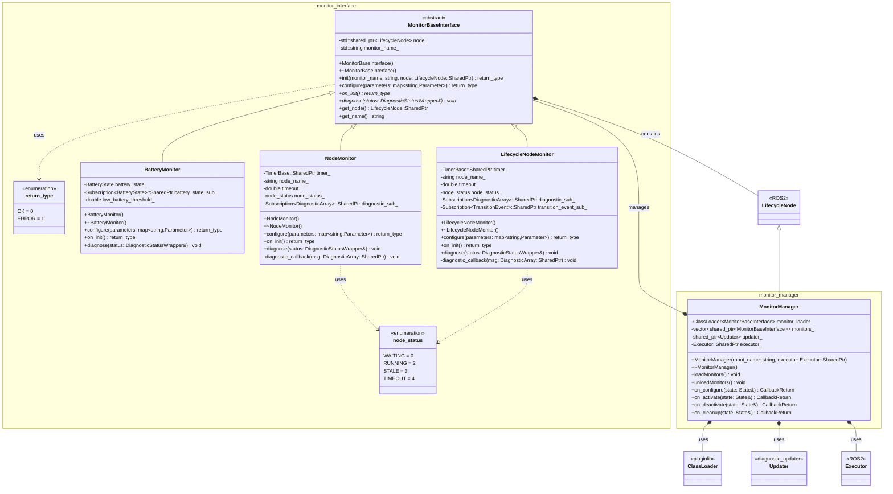
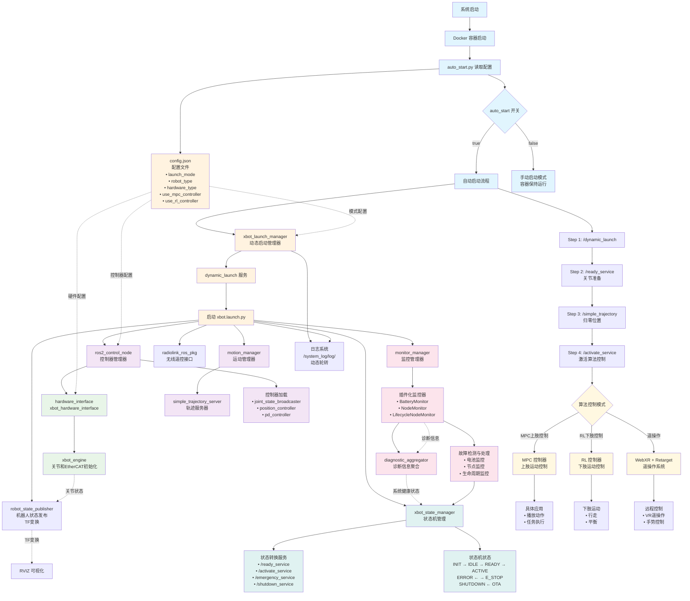

# 整机所有启动流程

# 启动代码

1. sdk启动
   1. bash hw_no_hand_pos.sh
2. 关节准备
   1. bash ready.sh
3. 关节归零位(算法准备) init
    1. bash zero.sh  或   bash lift.sh  或   bash mpc_init_pos.sh
4. 关节激活，可以被算法控制
   1. bash activate.sh
5. 下肢控制 rl
   1. rbevent启动rbevent：cd /root/xbot/algorithm/teleopx/rboperation && ./rbevent
   2. 启动rl python pub_client.py --type rl --cmd start
6. 上肢控制 mpc
   1. cd /root/xbot/algorithm/mpc/install/scripts/
   2. python pub_client.py --type mpc --cmd start
7. webxr启动
   1. conda activate teleoop
   2. cd /root/xbot/algorithm/teleopx/webxr/
   3. bash exec.sh
8. retarget启动
   1. conda activate teleop
   2. cd /root/xbot/algorithm/teleopx/retargetx
   3. bash exec.sh
9. 启动遥操作
   1. ros2 service call /Start_EE_Retarget std_srvs/srv/Trigger

# 代码启动

> 总体启动

> xbot_controller启动流程
-----

> hardware_interface插件启动流程
-----

>  xbot_state_manager ready流程
----

<!-- sequenceDiagram
    %% 参与者定义
    participant xbot_state_manager as xbot_state_manager
    participant xbot_control as xbot_control(ros2_control_node)

    %% 注释
    Note over xbot_state_manager: 状态  [Init IDLE Ready Active Error SHUTDOWN]

    %% 注释
    Note over xbot_state_manager: 服务  [clean_error_service ready_service,ota_service shutdown_service emergency_service activate_service deactivate_service error_service emergency_lifted_service] -->

# 启动流程

# monitor_manager监控流程

# 启动流程

